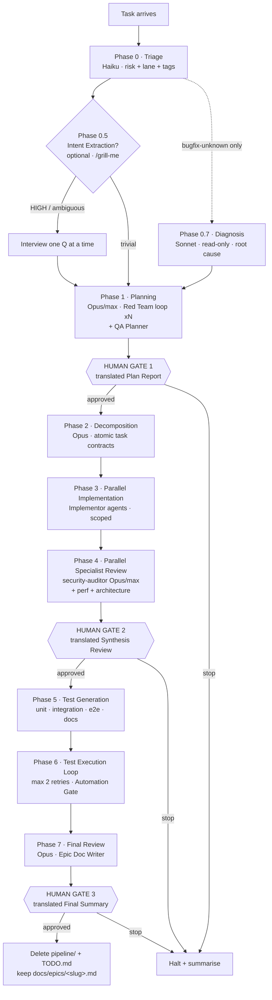
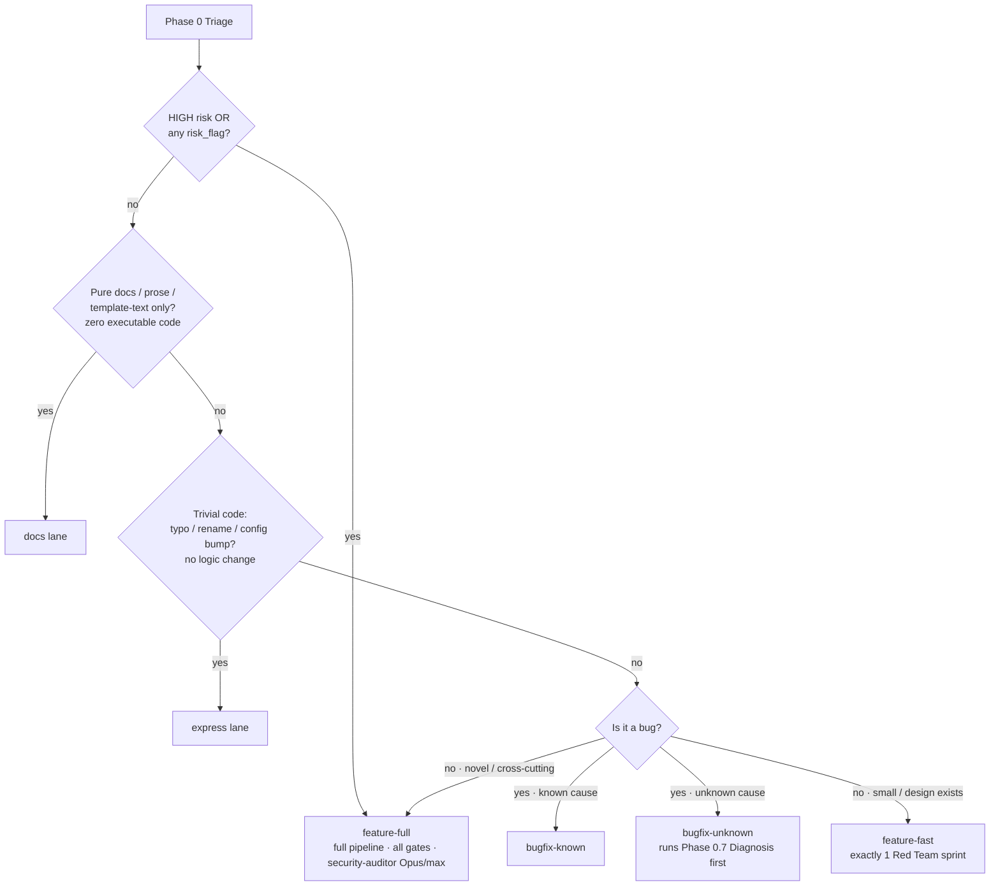
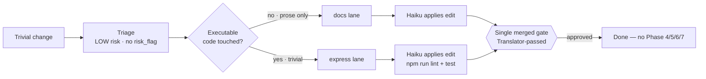
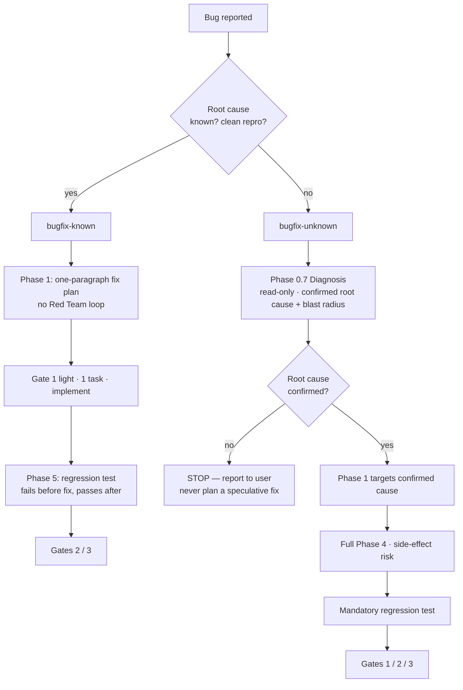
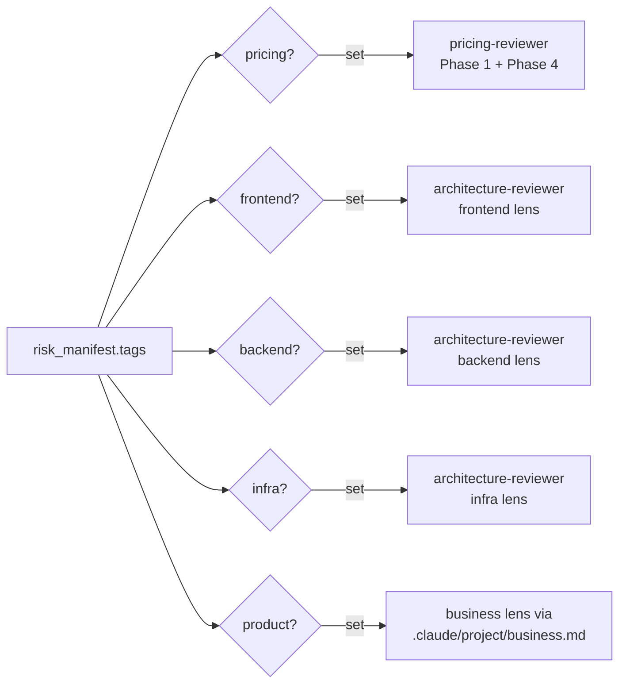

# Pipeline Workflows

A single-page map of how `claude-web-dev-skills` runs. The orchestrator
(`CLAUDE.md`) routes every task through **one adaptive lane**. The lane decides
*how deep* each phase runs — phase definitions never change, only their depth,
model, and which gates collapse.

> All diagrams below reflect `web-dev/template/CLAUDE.md` (the canonical
> orchestrator). If you change a phase or lane there, update this file in the
> same commit.

---

## 1. The full pipeline (feature-full — the default & fail-safe)

The three **Human Gates** are hard stops. The orchestrator never pre-generates
the next phase or proceeds without an explicit yes.

---

## 2. Triage → which lane?

Phase 0 picks the lane against a fixed rubric. The **lane fail-safe** is
non-negotiable: HIGH risk *or* any `risk_flag` (auth, pii, payment,
public-facing API, admin, file upload / user content) ⇒ `feature-full`,
regardless of how small the change looks.

**Rule of thumb:** when uncertain between two lanes, pick the heavier one. A
lane may only *reduce* ceremony for genuinely low-risk work — it can never
strip a security gate.

---

## 3. What each lane actually runs

| Lane | 0.5 | 0.7 | Phase 1 | Phase 2 | Phase 3 | Phase 4 | Phase 5–7 | Human Gates | Model |
|---|---|---|---|---|---|---|---|---|---|
| **express** | – | – | – | – | direct edit | – | – (lint+test only) | **1 merged** | Haiku |
| **docs** | – | – | – | – | direct edit | – | – (lint if applicable) | **1 merged** | Haiku |
| **bugfix-known** | – | – | 1-para plan, no Red Team | 1 task | scoped | risk-gated | regression test | 1 / 2 / 3 | Haiku/Sonnet |
| **bugfix-unknown** | – | ✅ Diagnosis | targets root cause, 1–2 sprints | ✅ | scoped | **full** | regression test | 1 / 2 / 3 | Sonnet→ |
| **feature-fast** | opt | – | **1** Red Team sprint | ✅ | ✅ | risk-gated | ✅ | 1 / 2 / 3 | per table |
| **feature-full** | opt | – | `sprint_count` sprints | ✅ | ✅ | **full** | ✅ | 1 / 2 / 3 | per table |

Gate-collapse: **only** the `express` and `docs` lanes merge the three Human
Gates into one lightweight, Translator-passed confirmation — permitted ONLY
when risk_level is LOW, no risk_flag is set, and (for docs) zero executable
code is touched. Every other lane keeps all three gates. The gate is *merged,
never skipped* — the human still explicitly approves once.

---

## 4. Fast lanes — express & docs

These exist to stop a typo or a README tweak from dragging the full 7-phase /
12-agent machinery (~300–600k tokens) when ~5–20k will do.

---

## 5. Bug lanes — known vs unknown

---

## 6. Conditional specialists (tag-gated)

Extra reviewers only join when Triage sets the matching tag — cost scales with
task size, not a fixed roundtable. `auth` / `pii` / `payment` are
**risk_flags** (not tags): they already make the `security-auditor` mandatory
in Phase 4.

`.claude/project/` scope-down notes are **authoritative**: if a project
declares an optional specialist Not-Applicable, Triage hard-skips it every run
without re-deliberating — but it can never skip a mandatory security gate.

---

## Slash-command entry points

| Command | Enters at |
|---|---|
| `/start` | Repository Assessment (pre–Phase 0) |
| `/plan` | Phase 0 Triage + Phase 1 → Gate 1 |
| `/implement` | Phase 2 + Phase 3 |
| `/review` | Phase 4 → Gate 2 |
| `/test` | Phase 5 + Phase 6 |
| `/fix` | Phase 6 only (drive failing tests green) |
| `/grill-me` | Phase 0.5 Intent Extraction |
| `/diagnose` | Phase 0.7 Diagnosis (read-only) |
| `/qa-plan` | Phase 1 QA Planner (on demand) |
| `/epic-doc` | Phase 7 Epic Doc Writer (on demand) |
| `/setup-project` | Populate `.claude/project/` |
